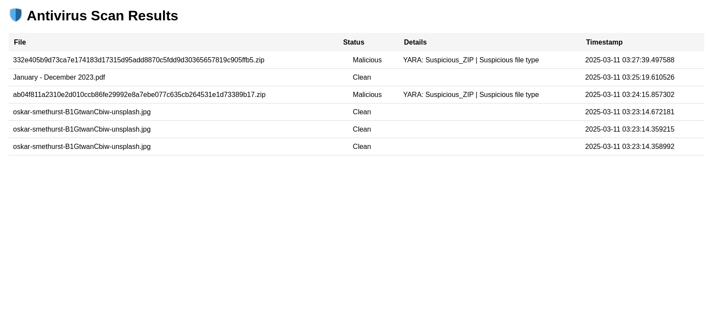
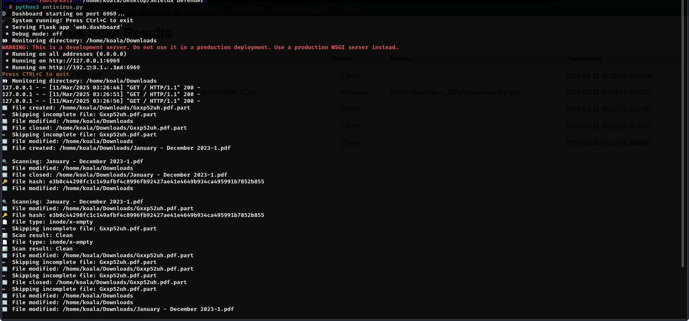

# 🛡️ ShieldX-Defender


## Overview
**ShieldX-Defender** is a Python-based antivirus scanner that integrates real-time file monitoring with YARA rule-based scanning and known malware hash detection. Designed for both security enthusiasts and developers, it provides robust protection against malicious files while offering a user-friendly web dashboard for monitoring.

## ✨ Features

- 🕵️ **Real-Time Monitoring**: Auto-scans files in specified directories
- ⚔️ **YARA Rule Engine**: Custom malware detection using YARA rules
- 🔒 **Hash-Based Detection**: SHA256 comparison against known malware database
- 📊 **Web Dashboard**: Real-time scan results via Flask interface
- 🚨 **Suspicious File Alerts**: Flags executables/ZIPs/risky file types
- 🖥️ **Cross-Platform**: Works on Linux, Windows, and macOS


## 🚀 Installation  <!-- STEP 1 HERE -->

### Prerequisites
- Python 3.8+
- **libmagic** (for file type detection):
  ```bash
  # Linux (Debian/Ubuntu)
  sudo apt-get install libmagic1

  # macOS
  brew install libmagic

  # Windows (via Chocolatey)
  choco install libmagic
# Steps
 Clone the repository:
 
     git clone https://github.com/the0ffs3c/ShieldX-Defender.git
     cd ShieldX-Defender
   

### 🖥️ Usage  
 
  Basic Command:
    
    ```bash
      # Monitor the default directory (Downloads)
      python3 antivirus.py  
  Custom Monitoring:
   
      # Monitor a custom directory and change the dashboard port
      python3 antivirus.py --monitor /path/to/directory --port 8080


  Web Dashboard:
  
  "After starting the tool, access the dashboard at http://localhost:6969 to view real-time scan results."

## CLI Options Table:

      Flag                     Description                          Default
 
    --monitor<PATH>            Directory to monitor                 ~/Downloads

    --port <NUM>               Web dashboard port                    6969

    --verbose                  Enable detailed logging               False
      
# Project Structure  
### Directory Tree:

      ShieldX-Defender/
      ├── core/               # Core logic (scanning, monitoring)
      ├── web/                # Flask-based dashboard
      ├── data/               # YARA rules and malware hashes
      ├── tests/              # Unit/integration tests
      └── requirements.txt    # Python dependencies

### File Descriptions:

      - `core/scanner.py`: Implements file scanning using YARA and hash checks.
      - `web/dashboard.py`: Runs the Flask server for the web interface.
      - `data/yara_rules/`: Store custom YARA rules here (e.g., `ransomware.yar`).

# 🛠️ Troubleshooting  

### Common Errors & Fixes:

    ### "Magic Library Not Found"
      Install `libmagic` for your OS:
      ```bash
      # Ubuntu/Debian
      sudo apt-get install libmagic1

## "YARA Rules Not Loading"

   #### Verify file permissions:

      chmod 644 data/yara_rules/*.yar

Ensure YARA files are in data/yara_rules/ and have .yar extensions.

Validate rule syntax:

      yara data/yara_rules/exploits.yar test_file.exe
### Web Dashboard Not Accessible

####  1.Allow firewall access for port 6969

#####  2.Check for port conflicts

## 📸 Screenshots

### Web Dashboard


### Malware Alert


# 🤝 Contributing

Fork the repository

Create a feature branch:

      git checkout -b feature/amazing-feature

Commit changes:

      git commit -m "Add amazing feature"

Push to branch:

      git push origin feature/amazing-feature
Open a Pull Request


# 📜 License

  Distributed under the MIT License. See LICENSE for details.

# 📞 Contact
Report Issues: GitHub Issues

Email: the0ffs3c@gmail.com

  


      
